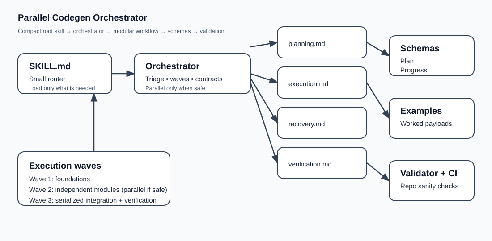

# Parallel Codegen Orchestrator

[](LICENSE)
[](https://github.com/Emily2040/parallel-codegen-orchestrator/actions/workflows/validate.yml)
[](https://github.com/Emily2040/parallel-codegen-orchestrator)

A portable agent skill for planning, generating, resuming, verifying, and safely parallelizing substantial code work.

## What this is for

Use this skill when the request spans multiple files, has non-trivial dependencies, benefits from resumability, or needs explicit verification and safe coordination.

Typical fits:
- greenfield projects
- large features
- multi-file refactors
- interrupted code generation that needs reliable recovery
- work where parallel execution might help but only behind real file and interface boundaries

This skill is not for tiny one-file edits that fit in a clean patch.

## Design choices

- **Compact root skill:** `SKILL.md` stays under the audit budget and routes into the orchestrator.
- **Progressive disclosure:** deep instructions live in `references/` and `skills/core/`.
- **Portable wrappers:** thin entrypoints for AGENTS-style loaders, Claude, Gemini, Cursor, Windsurf, and Cline-style tools.
- **Structured contracts:** JSON schemas define plan, progress, and final handoff payloads.
- **Anti-slop guardrails:** the registry bans hype, fake certainty, and arbitrary padding.
- **Parallel only when safe:** execution waves preserve deterministic integration.
- **Recovery from stable anchors:** file, symbol, patch, or digest boundaries beat guessed truncation recovery.

## Repository map

```text
parallel-codegen-orchestrator/
├── SKILL.md
├── AGENTS.md
├── CLAUDE.md
├── GEMINI.md
├── .cursorrules
├── .clinerules
├── .gitignore
├── README.md
├── LICENSE
├── references/
│   └── codegen-orchestrator.md
├── skills/core/
│   ├── planning.md
│   ├── execution.md
│   ├── recovery.md
│   └── verification.md
├── registry/
│   └── forbidden-slop.json
├── schemas/
│   ├── plan.schema.json
│   ├── progress.schema.json
│   └── final-report.schema.json
├── examples/
│   ├── request.md
│   ├── plan.json
│   ├── progress.json
│   └── final-report.json
├── docs/
│   ├── index.html
│   ├── REDESIGN_NOTES.md
│   └── assets/
│       └── architecture.svg
├── scripts/
│   └── validate_repo.py
└── .github/workflows/
    └── validate.yml
```

## Installation

### Generic canonical layout

```bash
mkdir -p .agents/skills
cp -R parallel-codegen-orchestrator .agents/skills/
```

### AGENTS-style loaders

```bash
printf '%s\n' 'Load AGENTS.md from .agents/skills/parallel-codegen-orchestrator/'
```

### Claude Code

```bash
printf '%s\n' 'Point Claude Code at CLAUDE.md in the skill root'
```

### Gemini CLI

```bash
printf '%s\n' 'Point Gemini at GEMINI.md in the skill root'
```

### Cursor / Windsurf / Cline-style IDE agents

```bash
printf '%s\n' 'Use .cursorrules or .clinerules as the thin wrapper entrypoint'
```

## How the workflow works

1. **Triage** the request into direct edit, mini plan, or full orchestration.
2. **Plan** real modules and execution waves.
3. **Execute** one ready module or one safe wave at a time.
4. **Recover** from stable anchors if interrupted.
5. **Verify** what was implemented versus what was actually checked.
6. **Handoff** with commands, evidence, and remaining risks.

## Parallel and async policy

Parallel or async execution is allowed only when dependency edges are satisfied, interfaces are frozen, file ownership does not overlap, and a later serialized integration step still exists.

If the host platform supports concurrent sub-agents or tool fan-out, a wave can run asynchronously. If not, the same plan executes sequentially with the same contracts and without pretending background work happened.

## Example output contracts

- `schemas/plan.schema.json`
- `schemas/progress.schema.json`
- `schemas/final-report.schema.json`

See `examples/` for a complete worked example.

## Validation

Run the validator locally:

```bash
python scripts/validate_repo.py
```

The validator checks:
- frontmatter shape and compact root size
- required files and wrappers
- author identity consistency
- placeholder leakage and cache artifacts
- internal markdown links
- schema parseability and example validation
- README polish and docs footer links

## Visual overview



## Why this redesign exists

Read `docs/REDESIGN_NOTES.md`.

The short version: the original mega-prompt had the right instincts about planning, recovery, verification, and coordination, but it coupled them to brittle token theater. This repo keeps the useful engineering logic and removes the ritual nonsense.

## Author

Created by **Iamemily2050**.

- GitHub: [Emily2040](https://github.com/Emily2040)
- Website: [Iamemily2050.com](https://Iamemily2050.com)
- X: [@iamemily2050](https://x.com/iamemily2050)
- Instagram: [@iamemily2050](https://instagram.com/iamemily2050)
